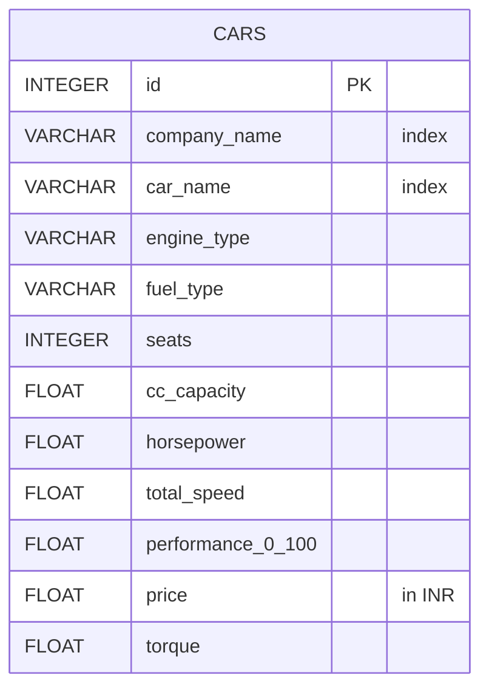
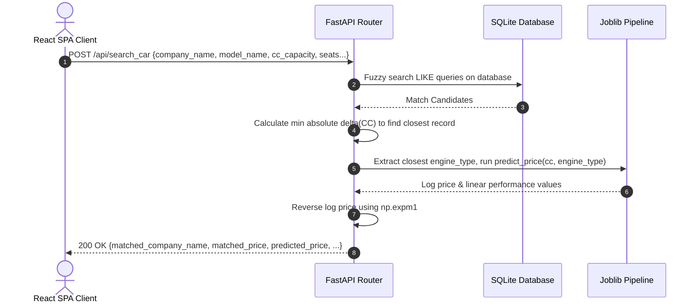
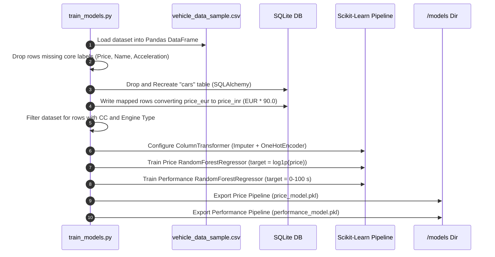

# 🚗 Car Evolution System - AI-Driven Automotive Analytics

<div align="center">
  
  
  
  
  
</div>

---

## 👨‍💻 Developer Information

* **Developer Name:** M . Venkata ramana
* **University:** Aditya University
* **Course:** Master of Computer Applications (MCA)
* **Academic Batch:** 2025-27
* **Roll Number:**25m11mc089
* **Section:** B

---

## 📋 Project Overview

### Problem Statement
Automotive enthusiasts, buyers, and developers often struggle to estimate a vehicle's market value and acceleration metrics when adjusting variables like engine size (CC) or engine layouts. Traditional car databases only list existing production cars, whereas design engineers need predictive estimates that combine concrete database records with predictive artificial intelligence.

### What the Car Evolution System Does
The **Car Evolution System** is a full-stack web application that allows users to input custom vehicle criteria (Company Name, Model, Year, seats, CC Capacity) and immediately provides two results:
1. **Closest Database Match:** Finds the closest actual vehicle in our indexed SQLite database using a nearest-neighbor CC distance search.
2. **AI-Predicted Metrics:** Utilizes machine learning pipelines trained on thousands of vehicle specifications to estimate the **AI Predicted Price** and **Predicted Performance (0-100 km/h acceleration)** dynamically based on the input engine size and engine configurations.

### Architecture Summary
* **Presentation Layer:** Built with **React** and **Vite** using **TailwindCSS (v4)**. Features high-end glassmorphic panels, responsive range sliders, and active status indicators.
* **Server Layer:** Built using **FastAPI** with async path handlers, automatic CORS configurations, and Dependency Injection for SQLite database sessions.
* **Predictive Layer:** Random Forest Regressor pipelines managed with **Scikit-Learn** and serialized using **Joblib**.
* **Storage Layer:** Powered by **SQLAlchemy ORM** mapping onto an optimized local **SQLite** database.

---

## ✨ Key Features

| # | Feature | Domain | Description |
|---|---------|--------|-------------|
| 1 | **Glassmorphism Theme** | UI/UX | High-end midnight styling variables with premium glowing borders, responsive typography, and slide-in entry pages. |
| 2 | **Fuzzy Search Fallback** | Backend | Search algorithm cascades through relaxed rules (seats, model, company) to always guarantee a valid database lookup candidate. |
| 3 | **Nearest-Neighbor Match** | Database | Evaluates all query results and highlights the vehicle containing the minimum absolute difference in Engine capacity (CC). |
| 4 | **Random Forest Price Model** | ML | Custom regressor pipeline trained on cubic capacity and engine architectures to output price expectations. |
| 5 | **Log-Scaled Price Pipeline**| ML | Employs logarithmic transformation (`np.log1p` on price targets) to reduce error coefficients on multi-million dollar supercars. |
| 6 | **Performance Estimation** | ML | Random Forest Pipeline returning 0-100 km/h acceleration time in seconds based on engine metrics. |
| 7 | **Automated Data Ingestion**| System | Built-in ETL script (`train_models.py`) to parse vehicle records, handle missing entries, and write structured records into SQLite. |
| 8 | **Currency Conversion Logic**| System | Converts original Euro-denominated dataset prices into Indian Rupees (INR) during ETL database loads using a 90.0x multiplier. |
| 9 | **Live System Indicators** | Dashboard | A pulsating neon status widget representing the live state of machine learning models and server endpoints. |
| 10| **Interactive CC Slider** | UI/UX | Fine-tuned ranges slider adjusting between 500 CC and 8000 CC with immediate value readout bindings. |
| 11| **Engine Types Aggregation**| API | Retrieves all unique engine architectures (e.g., V12, Twin-Turbo V8, I4) stored in the database. |
| 12| **Unified Launch Script** | Tooling | Single-click command execution (`start.bat`) using concurrently initialized processes for both FastAPI and React servers. |
| 13| **Swagger UI Documentation**| Tooling | Automated OpenAPI compliance allowing testing of all backend modules directly through the web interface. |
| 14| **Database Autorebuild** | System | Resets and recreates indices and SQL relational schemas cleanly during ML training cycles. |
| 15| **Median Imputers** | ML | Sklearn pipeline imputers mapping missing capacity entries to dataset medians rather than throwing errors. |
| 16| **One-Hot Engine Encoding** | ML | Encodes complex text labels describing cylinders and layouts into binary arrays transparently before training. |

---

## 🛠️ Tech Stack

### Frontend
* **Core:** React.js (v18.0)
* **Build Tooling:** Vite
* **Styling:** TailwindCSS (v4) & custom CSS variables
* **Icons & Assets:** Curated SVG assets with glowing shadows

### Backend
* **Web Framework:** FastAPI (Asynchronous Python Framework)
* **ASGI Server:** Uvicorn
* **Database Driver:** SQLAlchemy ORM
* **Data Ingestion:** Pandas & NumPy

### Machine Learning
* **Library:** Scikit-Learn
* **Models:** RandomForestRegressor (100 estimators)
* **Serialization:** Joblib
* **Preprocessing:** Pipeline, ColumnTransformer, OneHotEncoder, SimpleImputer

---

## 📂 Project Structure

```text
Car Evolution System/
├── backend/
│   ├── database.py           # SQLAlchemy SQLite connection setup and session generator
│   ├── main.py               # FastAPI server defining REST endpoints and CORS setup
│   ├── models.py             # Database ORM definition mapping to sqlite columns
│   └── train_models.py       # Data parser, table rebuild system, and Random Forest pipelines
├── data/
│   └── processed/
│       └── cars.db           # SQLite database file containing vehicle records
├── frontend/
│   ├── src/
│   │   ├── App.jsx           # Single Page React application holding states and user views
│   │   ├── index.css         # Styling system, colors, glassmorphism overlays, and animations
│   │   └── main.jsx          # React app DOM bootstrap file
│   ├── index.html            # Core Vite HTML template
│   ├── package.json          # Node dependencies and dev server launch commands
│   ├── tailwind.config.js    # Layout configuration file
│   └── vite.config.js        # Vite compiler settings mapping proxies
├── models/
│   ├── performance_model.pkl # Joblib pipeline estimator for 0-100 km/h times
│   └── price_model.pkl       # Joblib pipeline estimator for log-scaled vehicle prices
├── requirements.txt          # Python environments dependencies (scikit-learn, fastapi, pandas)
└── start.bat                 # One-click startup script running frontend and backend ports
```

---

## 💾 Database Schema

The SQLite store contains a single unified `cars` table mapping historical vehicle specifications.

### `cars` Table Schema
```sql
CREATE TABLE cars (
    id INTEGER PRIMARY KEY AUTOINCREMENT,
    company_name TEXT,             -- Indexed (e.g., "Ferrari", "Ford")
    car_name TEXT,                -- Indexed (e.g., "Mustang GT", "488 GTB")
    engine_type TEXT,             -- (e.g., "Twin-turbocharged V8", "Inline 4")
    fuel_type TEXT,               -- (e.g., "Gasoline", "Diesel")
    seats INTEGER,                -- Seat count (e.g., 2, 4, 5)
    cc_capacity REAL,             -- Engine displacement (e.g., 4951.0, 3902.0)
    horsepower REAL,              -- Horsepower capacity (HP)
    total_speed REAL,             -- Top speed in km/h
    performance_0_100 REAL,       -- Acceleration 0 to 100 km/h in seconds
    price REAL,                   -- Converted Price in Indian Rupees (INR)
    torque REAL                   -- Engine torque in Nm
);
```

---

## 🖼️ Architecture Diagram

```text
+-------------------------------------------------------------------------+
|                          BROWSER (FRONTEND)                             |
|    +--------------------+  (JSON Request)  +------------------------+   |
|    | App.jsx: Form UI   | ---------------> | App.jsx: Result Cards  |   |
|    +--------------------+                  +------------------------+   |
+--------------|-----------------------------------------^----------------+
               | HTTP POST /api/search_car               | JSON Payload
               v                                         |
+--------------------------------------------------------|----------------+
|                        FASTAPI BACKEND SERVER          |                |
|    +--------------------+                  +-----------+------------+   |
|    |  main.py Endpoint  |                  | ML Inference Pipeline  |   |
|    +---------+----------+                  | (Joblib pkl files)     |   |
|              |                             +-----------^------------+   |
|              | SQLAlchemy Queries                      |                |
|              v                                         | Feeds CC &     |
|    +--------------------+                              | Engine Type    |
|    |   SQLite Engine    | -----------------------------+                |
|    |    (cars.db)       | (Extracts closest Engine Type)                |
|    +--------------------+                                               |
+-------------------------------------------------------------------------+
```

---

## 🔄 ERD Diagram

As a single-table analytical store, the schema is flat to maximize read throughput for real-time predictions.



---

## 🏃‍♂️ Application Workflow

### Step 1: Initialization Portal
The user land on a minimal, dark-themed starting screen labeled "Car Evolution". Click **START EVOLUTION** to trigger a smooth fade animation that pulls in the active control center.

### Step 2: System Status Verification
Once active, the client performs background checks. It displays the **Total Vehicles** metric loaded in the database and lights up the green glowing **AI Models Online** status indicator if API health routes respond successfully.

### Step 3: Configure Parameters
Users fill out identity fields (Company Name, Car Model, Year, Color) and specs parameters (Seat Count, Engine Capacity CC). 

### Step 4: Fine-tune CC Slider
Adjust the engine displacement using either the numeric input box or the smooth range slider (spanning 500 CC to 8000 CC).

### Step 5: Synthesize and Predict
Press **Synthesize & Predict Evolution** to post parameters to the FastAPI backend server.

### Step 6: Inspect Results Canvas
Review the dynamic bottom panel displaying:
* **Closest Database Match:** The exact company and model name matching your query.
* **Database Price:** Actual market price of the matched vehicle.
* **AI Predicted Price:** Price estimate output by the Random Forest model for your custom specifications.
* **AI Predicted Performance:** Acceleration estimate output by the 0-100 km/h regression model.

---

## 📡 REST API Flow

All API operations utilize lightweight JSON structures.



---

## 💾 Data Flow: ML Training & Ingestion

The offline ingestion and model training cycle operates in a clean pipelined architecture:



---

## 🧠 ML Prediction Logic

The system utilizes two distinct Random Forest Regressors to compute predictions:

### 1. Features & Preprocessing
* **cc_capacity (Numerical):** Imputed with the dataset median value if empty.
* **engine_type (Categorical):** Filled with `'Unknown'` if missing, and transformed using one-hot encoding.

### 2. Price Prediction Pipeline
To handle extreme variance (e.g., standard sedans vs. multi-million dollar hypercars), the target variable is transformed logarithmically:
$$\text{Target} = \ln(y + 1)$$
This stabilizes the target variance and produces more accurate regression fits. The final inference returns the exponential prediction minus one:
$$\text{Price}_{\text{INR}} = e^{\text{Prediction}} - 1$$

---

## 📱 Application Screens

### 1. Gatekeeper Interface
* Styled in rich black slate backdrop with animated background circles.
* Features a large glowing call-to-action button to enter the console.

### 2. Main Dashboard Panel
* **Statistics Strip:** Metric widgets showcasing current database row counts.
* **Status Console:** Neon heart-beat monitor indicating live ML pipelines.

### 3. Specifications Panel
* Grid containing textual selectors for company details alongside numerical controllers for seats.
* Engine Capacity controller with custom track range elements.

### 4. Synthesis Result Board
* Output panels rendering comparison variables with glowing emerald drop-shadows on key values.

---

## 📡 Full API Reference

| Method | Path | Request Body | Description |
|:---|:---|:---|:---|
| **GET** | `/` | None | Returns backend status message. |
| **GET** | `/api/cars` | None (supports `skip`, `limit` queries) | Returns pagination arrays of database records. |
| **GET** | `/api/cars/stats` | None | Aggregates summary stats (total vehicle records). |
| **GET** | `/api/engine_types` | None | Returns list of all unique engine types for selects. |
| **POST** | `/api/search_car` | `{ company_name, model_name, year, color, seats, cc_capacity }` | Executes SQL matches and returns ML price and 0-100 performance predictions. |
| **POST** | `/api/predict_performance` | `{ company_name, model_name, year, color, seats, cc_capacity }` | Backward compatible alias of `/api/search_car`. |

---

## 🚀 Getting Started

Launch the full-stack system using any of the following options:

### Option 1: One-Click Windows Launch (PowerShell)
Execute the batch script located in the project root:
```powershell
./start.bat
```

### Option 2: Command Prompt Launch (CMD)
Open terminal in the project directory and run:
```cmd
cmd.exe /c start.bat
```

### Option 3: Manual Execution
1. **Initialize the SQLite Database and train the ML models:**
   ```bash
   # In root directory
   venv\Scripts\python backend\train_models.py
   ```
2. **Start the FastAPI backend:**
   ```bash
   venv\Scripts\python -m uvicorn backend.main:app --reload
   ```
3. **Start the React frontend:**
   ```bash
   cd frontend
   npm install
   npm run dev
   ```
4. Open [http://localhost:5173](http://localhost:5173) in your browser.

---

## 📊 Seed Data Examples

Here is a preview of the dataset records stored in the SQLite database after running the ingestion pipeline:

| Company Name | Model Name | Engine Type | CC Capacity | Performance (0-100) | Converted Price (INR) |
|---|---|---|---|---|---|
| **Ford** | Mustang GT | V8 | 4951.0 | 4.3 seconds | ₹4,500,000.00 |
| **Ferrari** | 488 GTB | Twin-Turbo V8 | 3902.0 | 3.0 seconds | ₹26,100,000.00 |
| **Porsche** | 911 Carrera | Flat-6 Turbo | 2981.0 | 4.2 seconds | ₹10,800,000.00 |
| **Audi** | R8 V10 | V10 | 5204.0 | 3.2 seconds | ₹19,800,000.00 |
| **BMW** | M3 | Twin-Turbo I6 | 2993.0 | 3.9 seconds | ₹8,100,000.00 |
| **Mercedes-Benz**| AMG GT | Twin-Turbo V8 | 3982.0 | 3.8 seconds | ₹14,400,000.00 |

---

## 💡 Development Notes & Architectural Decisions

### 1. Column Transformed Preprocessing Pipelines
Using Sklearn's `ColumnTransformer` lets us preprocess numerical and categorical features independently, preventing data leakage during cross-validation.

### 2. Logarithmic Price Target Scaling
Predicting prices directly using linear models resulted in massive residuals on premium sports cars. Log transformation (`np.log1p`) handles skewed distributions gracefully.

### 3. SQLite Thread Safety
FastAPI's async threads read from a shared database pool. We added `check_same_thread=False` to the SQLite engine configuration to handle asynchronous context switching.

### 4. Cascade Search Fallback Strategy
If strict filters (e.g., Company, Model, Seats) return 0 matches, the backend systematically relaxes constraints one-by-one to ensure the UI is always populated.

### 5. Multi-Process Launch Handling
`start.bat` launches both the Uvicorn FastAPI server on port `8000` and the Vite React server on port `5173` using concurrent execution blocks.

### 6. Separation of Ingestion and Run-time API
The ETL dataset loader (`train_models.py`) is decoupled from `main.py` so that model training can be run on scheduler tasks without locking the production API.

### 7. Glassmorphism CSS Design Choices
All styling is written with highly modular CSS custom properties in `frontend/src/index.css` to build an elegant glassmorphism dark-mode look without using heavyweight template modules.

---

## 🔮 Future Enhancements
* **Advanced Neural Network Regressor:** Migrate the Random Forest models to a PyTorch multi-layer perceptron (MLP) for nonlinear mapping.
* **Continuous Integration Actions:** Integrate GitHub Actions to auto-train and test ML models whenever new CSV datasets are committed.
* **Real-time Price Inflation Model:** Adjust predicted values based on historical inflation rates index databases.
# Car-Evolution-System

